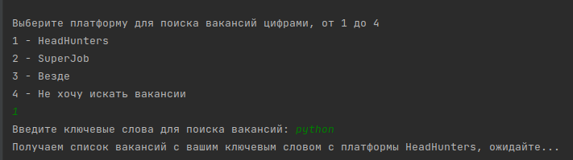
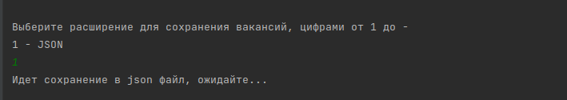
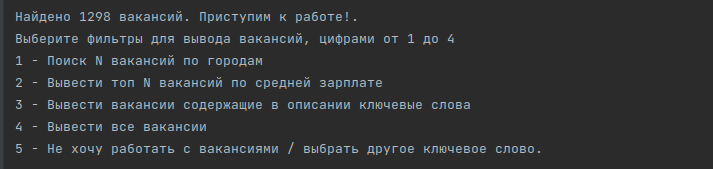

# **COURSE WORK № 4** 
_Это проект, написанный на языке Python, который выполняет обработку текста с использованием парсинга. Он позволяет извлекать информацию из текстового файла и проводить различные операции над этой информацией._

### **Установка**
Для установки проекта cw4_parsing, следуйте инструкциям ниже:

1. Склонируйте репозиторий на своем компьютере:

`git clone https://github.com/VictorVolkov7/cw4_parsing.git`

2. Перейдите в папку с проектом:

`cd cw4_parsing`

3. Создайте и активируйте виртуальное окружение:

`poetry init`

`poetry shell`

4. Установите зависимости проекта:

`poetry install`

### **Использование**
После установки проекта cw4_parsing, вы можете использовать его для поиска вакансий по ключевому слову на различных платформах. Примеры использования указаны ниже:

1. Вы выбираете платформу для поиска вакансий и после выбора вводите ваше ключевое слово (например 'python').

2. После этого Вы выбираете нужное расширение файла для сохранения ваших вакансий.

3. После этого вы уже можете искать и работать с вакансиями по предложенным фильтрам

Автор
VictorVolkov7 - vectorn1212@gmail.com